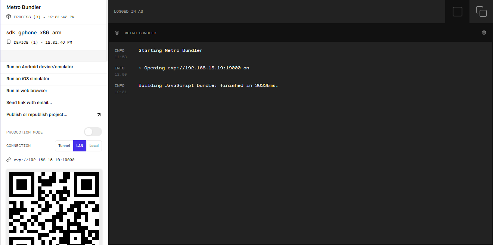
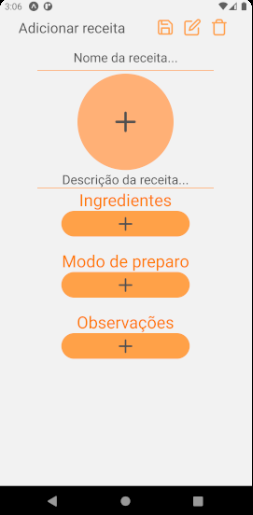

# Aplicativo de Receitas simples com Expo.

## Como rodar o projeto
  - Para rodar esse projeto, clone ele com o comando:
    ```
    git clone https://github.com/HigorJ/RecipeApp-ReactNative.git
    ```

  - No console ou prompt de comando, vá para a pasta do projeto.

  - Instale as dependências com o seguinte comando (Caso já tenha o NPM instalado):
    ```
    npm install
    ```

  - Depois que instalar as dependências, rode: 
    ```
    npm run start
    ```

  - Ao rodar o comando, você verá a seguinte tela abrir no browser:
  <center>
  
    
  
  </center>

  - Rode no dispositivo que quiser, emulador android, ios etc.

## Tecnologias
  - Expo.
  - SQLite.
  
## Screens
  - Ao iniciar o app e ele carregar, você verá essa tela de menu vazio:


  &nbsp;
  <center>
  
    
  
  </center>

  - Se clicar no botão flutuando de "+", ele redirecionará você para a tela de criar uma nova receita:


  &nbsp;
  <center>
  
    
  
  </center>

  - Para adicionar um ingrediente clique no botão "+" na aba de ingredientes. O mesmo ocorre para os passos do modo de preparo e as observações. Ao concluir, a tela ficará assim:


  &nbsp;
  <center>
  
    
  
  </center>

  - Ao salvar a receita, o menu ficará assim:


  &nbsp;
  <center>
  
    
  
  </center>

  - E ao clicar em uma receita já criada, redirecionará para essa tela que você poderá usar para atualizar a receita ou para deletar ela:


  &nbsp;
  <center>
  
    
  
  </center>
